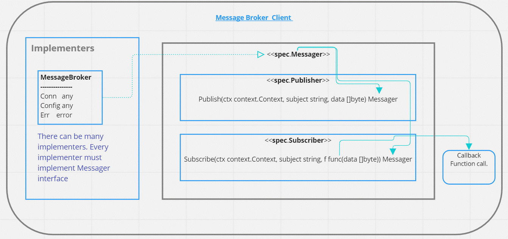

### Message Broker Go Client
# mb-go-client

## Architecture 

## Spec
- Every message broker component must implement   Messager interface.
Messager interface consists of two other interfaces, Publisher and Subscriber.

### 1. Publisher : To publish messages to a Subject with payload/data.
- Function Signature:
    - Publish(ctx context.Context, subject string, data []byte) Messager
- Input:
    - ctx context.Context : Usually a context will be propagated across application boundaries.
    - subject string : subject/topic to which the message to be published
    - data []byte : payload/data that has to be published
- Returns:
    - Messager: the return type is  messager interface itself. This helps to Publish and Subscribe as chain of events.

### 2. Subscriber : Subscribe to  receives data based on Subject. Whatever user has to do with the received data,  can be implemented in the call back function.
- Function Signature:
    - Subscribe(ctx context.Context, subject string, f func(data []byte)) Messager
- Input:
    - ctx context.Context : Usually a context will be propagated across application boundaries.
    - subject string : subject/topic on which the data to be received.
    - f func(data []byte): It a call back function. Data that is received from a subject is automatically assigned to data parameter in function call. User has to implement required business logic in the call back function with the data.
- Returns:
    - Messager:  the return type is messager interface itself. This helps to Publish and Subscribe as chain of events.

