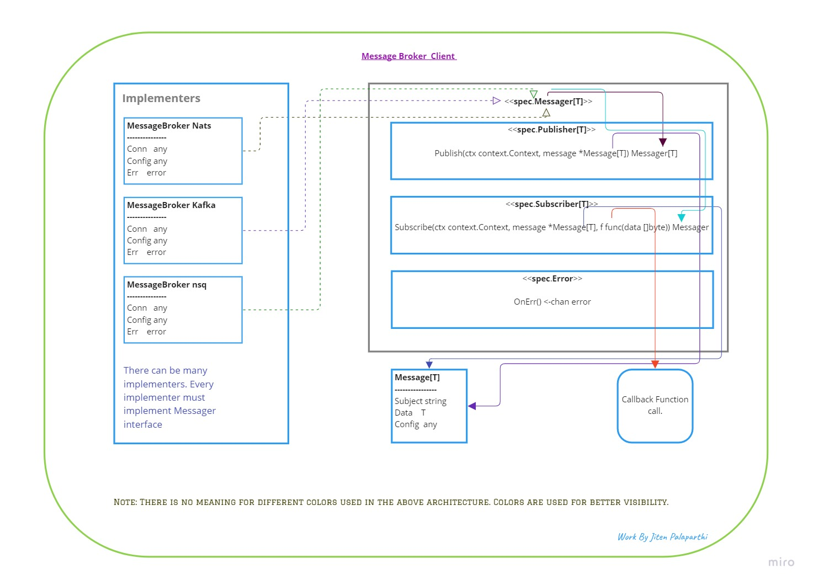
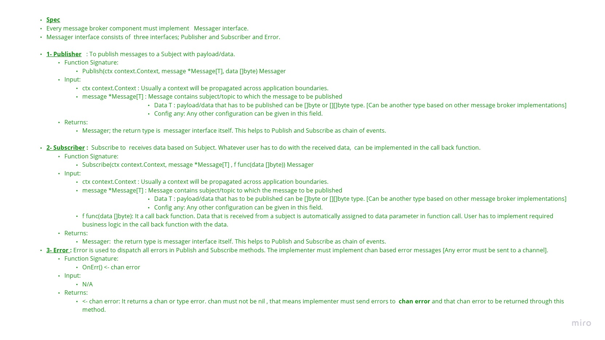

### Message Broker Go Client
# mb-go-client

## Architecture 

## Spec

## Spec

- Every message broker component must implement Messager interface.
Messager interface consists of three interfaces; Publisher and Subscriber and Error.

1. Publisher   : To publish messages to a Subject with payload/data.
    - Function Signature:
        Publish(ctx context.Context, message *Message[T], data []byte) Messager
    - Input:
        ctx context.Context : Usually a context will be propagated across application boundaries.
        message *Message[T] : Message contains subject/topic to which the message to be published
        Data T : payload/data that has to be published can be []byte or [][]byte type. [Can be another type based on other message broker implementations]
        Config any: Any other configuration can be given in this field.
    - Returns:
        Messager; the return type is  messager interface itself. This helps to Publish and Subscribe as chain of events.

2. Subscriber :  Subscribe to  receives data based on Subject. Whatever user has to do with the received data,  can be implemented in the call back function.
    - Function Signature:
        Subscribe(ctx context.Context, message *Message[T] , f func(data []byte)) Messager
    - Input:
        ctx context.Context : Usually a context will be propagated across application boundaries.
        message *Message[T] : Message contains subject/topic to which the message to be published
        Data T : payload/data that has to be published can be []byte or [][]byte type. [Can be another type based on other message broker implementations]
        Config any: Any other configuration can be given in this field.
        f func(data []byte): It a call back function. Data that is received from a subject is automatically assigned to data parameter in function call. User has to implement required business logic in the call back function with the data.
    - Returns:
        Messager:  the return type is messager interface itself. This helps to Publish and Subscribe as chain of events.

3. Error : Error is used to dispatch all errors in Publish and Subscribe methods. The implementer must implement this method.
    - Function Signature:
        Error() error
    - Input:
        N/A
    - Returns:
        error: If there is any error in the propagation of methods, the error is set and retruns using this method.